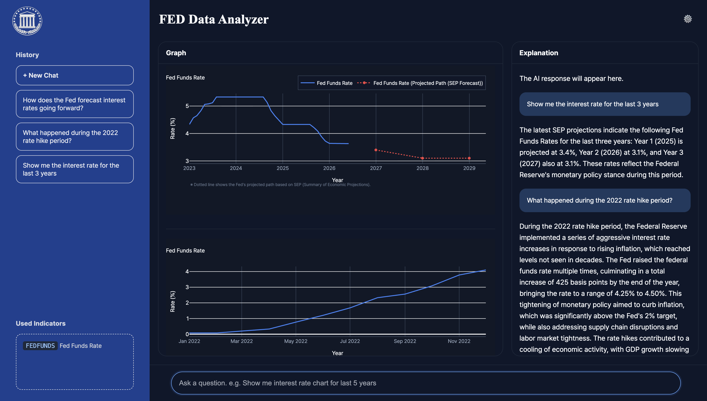
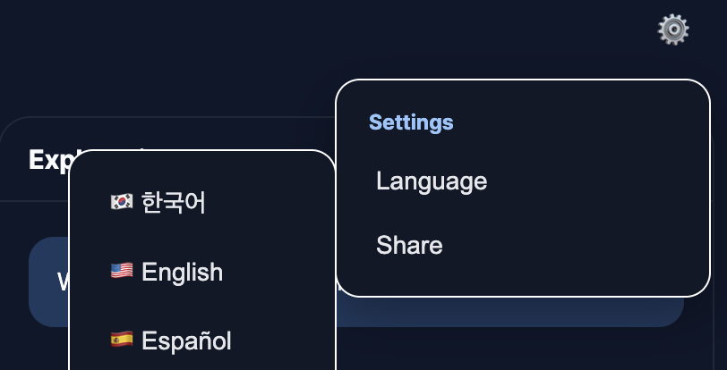
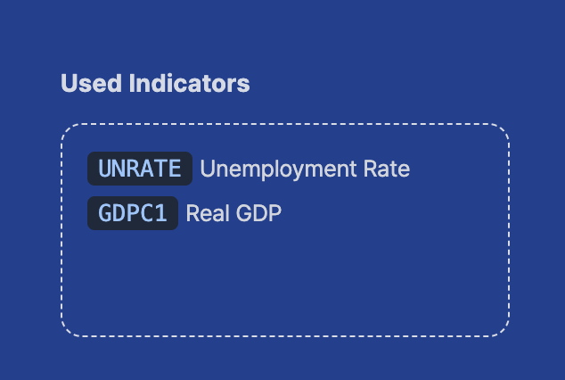
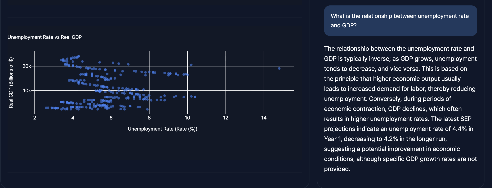
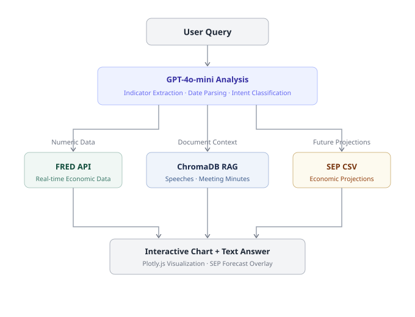

# Fed Data Chatbot

> 🏆 **KCU 2026 — Best Project Award · 1st Place** *(University of Wisconsin-Madison)*

FRED API + RAG 기반 미국 연준(Federal Reserve) 경제 데이터 분석 챗봇

[](https://kcu-fed.onrender.com/)

> Cold start: 첫 접속 시 약 30초 소요될 수 있습니다.

---

## 프로젝트 소개

자연어로 질문하면 미국 연준의 경제 데이터를 분석해주는 AI 챗봇입니다.  
FRED API로 실시간 경제지표를 수집하고, 연설문·회의록·SEP 문서를 RAG로 연결해  
수치와 맥락, 미래 전망을 동시에 제공합니다.

---

## 스크린샷



<p align="center">
  
  
</p>

<p align="center">
  
</p>

---

## 주요 기능

- **인터랙티브 차트** — 기준금리·CPI·실업률·GDP 등 10개 이상 지표 시각화 (Plotly.js)
- **RAG 기반 답변** — 연준 연설문 223개 + FOMC 회의록 기반 맥락 답변
- **SEP 전망 오버레이** — Fed 공식 경제 전망치를 차트에 점선으로 표시
- **자동 업데이트** — APScheduler로 매일 새벽 4시 최신 문서 자동 수집
- **다국어 지원** — 한국어 / 영어 / 스페인어
- **반응형 UI** — 모바일 환경 지원

---

## 기술 스택

| 분류 | 기술 |
|------|------|
| Backend | Python 3.11, Flask, LangChain, ChromaDB |
| AI/LLM | OpenAI GPT-4o-mini, text-embedding-3-small |
| Data | FRED API, BeautifulSoup, pypdf |
| Frontend | HTML/CSS/JS, Plotly.js |
| Infra | Render, APScheduler |

---

## 시스템 아키텍처



---

## 담당 파트

**Role: Project Lead Engineer**

- **SEP end-to-end 파이프라인** — PDF 크롤링(`sep_crawler.py`) → 데이터 구조화(`sep_structurer.py`) → CSV 저장 → GPT 프롬프트 주입 → 차트 오버레이까지 전체 설계 및 구현
- **백엔드 전반** — Flask API 설계(`/api/chat`, `/api/chart`), RAG 파이프라인 구축
- **RESTful API 이중 엔드포인트 설계** — 텍스트 답변과 차트 데이터를 분리 처리해 프론트엔드 렌더링 최적화
- **자연어 → FRED ticker 자동 매핑** — 키워드 기반 매핑 로직 직접 구현으로 LLM 의존도 최소화 및 응답 지연 감소
- **질문 의도 기반 차트 타입 자동 분기** — 시계열 질문은 라인차트, 관계 분석 질문은 산점도로 자동 전환
- **ChromaDB 임베딩 파이프라인** — 청크 분할, 벡터화, API 요청 제한(429) 대응 retry 로직 구현
- **APScheduler 자동 업데이트** — 매일 새벽 4시 최신 연설문·회의록 자동 수집 스케줄러 설계
- **프론트엔드** — 반응형 UI, Plotly.js 차트 연동, 다국어 지원(한국어·영어·스페인어)

> 본 프로젝트는 팀 프로젝트이며, 위 파트를 담당했습니다.

---

## 프로젝트 구조

```
fed-data-chatbot/
├── app.py                # Flask 서버 + RAG 파이프라인
├── sep_crawler.py        # SEP PDF 크롤링
├── sep_structurer.py     # SEP 데이터 구조화 -> CSV
├── sep_values.csv        # 구조화된 SEP 전망 데이터
├── index.html            # 프론트엔드
├── requirements.txt
├── assets/               # 스크린샷 및 다이어그램
└── .env                  # API 키 (Git 제외)
```
