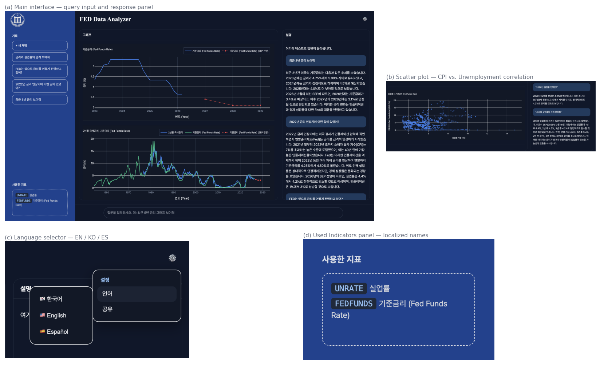
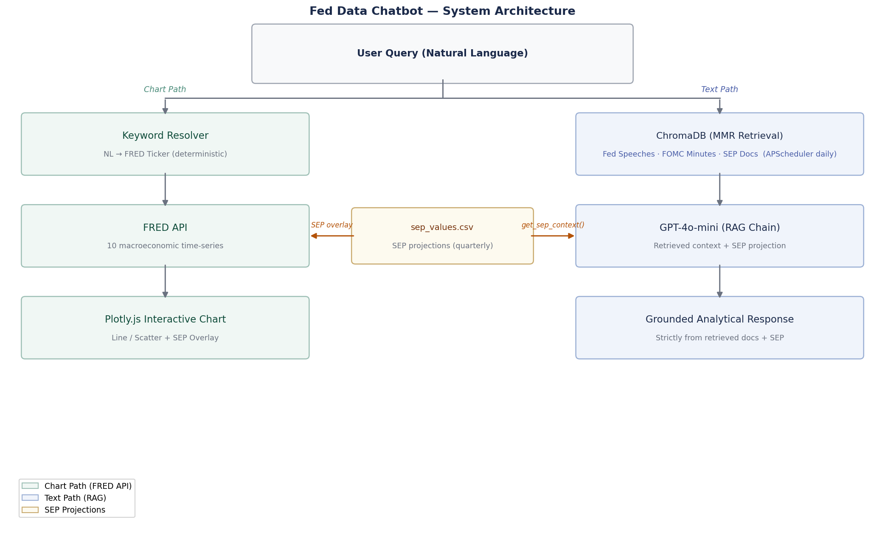
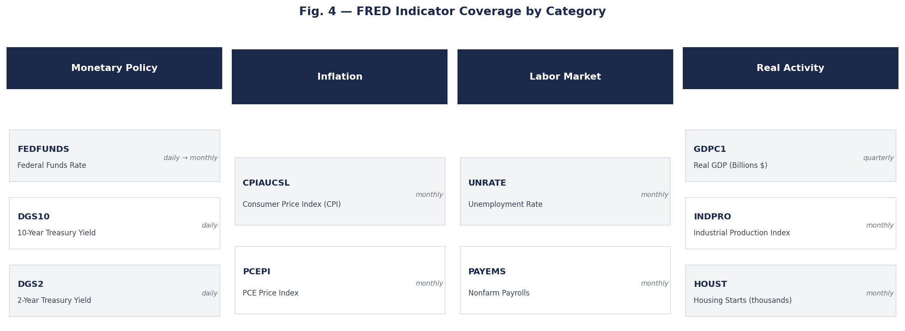
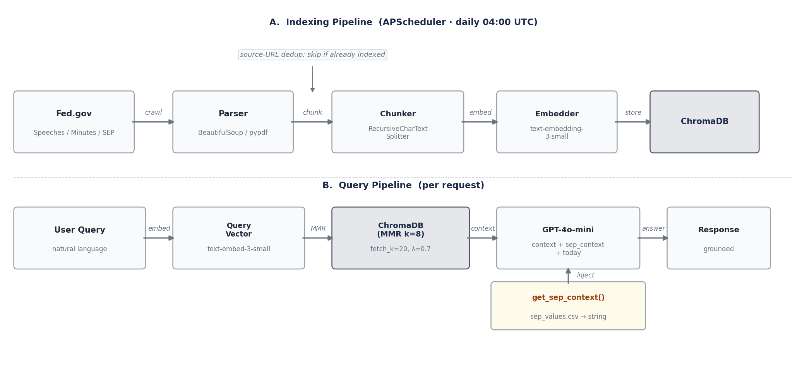

\begin{center}

\vspace{1em}

\textbf{Yoon Hwang} $\mid$ University of Wisconsin-Madison $\mid$ Data Science \& Economics \& Information Science

\medskip

yoondbs3@gmail.com $\mid$ github.com/yhwang55

\medskip

\textbf{[Best Project Award $\cdot$ 1st Place]} KCU 2026 \textit{(University of Wisconsin-Madison)}

\end{center}

\vspace{1em}
\hrule
\vspace{1em}

\tableofcontents

\newpage

## Abstract

This report presents the architecture and engineering decisions behind a retrieval-augmented generation (RAG) chatbot for natural language querying of U.S. Federal Reserve monetary policy data. The system integrates two complementary data pipelines: (1) real-time macroeconomic time-series retrieval via the FRED API, and (2) a ChromaDB vector database of Fed speeches, FOMC meeting minutes, and Summary of Economic Projections (SEP) documents indexed with OpenAI text embeddings. User queries are processed in parallel through a deterministic keyword-to-ticker resolver (chart data) and a LangChain RAG chain with Maximal Marginal Relevance (MMR) retrieval (text response). Key design contributions include: hallucination prevention via strict prompt grounding, dynamic per-request SEP context injection, source-level document deduplication, intent-based chart type routing, and SEP overlay auto-suppression for historical date-range queries. The system supports multilingual interaction (English, Korean, Spanish) with full localization across UI text, chart axis labels, indicator names, and SEP overlay labels. The deployed application is available at [kcu-fed.onrender.com](https://kcu-fed.onrender.com/).

**Keywords**: Retrieval-Augmented Generation, FRED API, Federal Reserve, Macroeconomic Analysis, Natural Language Interface, ChromaDB, LangChain, MMR Retrieval, Hallucination Prevention, SEP Forecasts, Internationalization

---

## 1. Introduction

### 1.1 Background and Motivation

The Federal Reserve System generates substantial volumes of public-facing documents — FOMC meeting minutes, Chair speeches, and quarterly Summary of Economic Projections — that collectively form a detailed textual record of U.S. monetary policy. Simultaneously, the Federal Reserve Bank of St. Louis maintains the FRED (Federal Reserve Economic Data) API, providing programmatic access to hundreds of macroeconomic time-series indicators updated in real time. Extracting actionable insights from this dual data landscape currently requires analysts to manually cross-reference quantitative FRED data with qualitative Federal Reserve publications — a time-intensive process that assumes both economic domain knowledge and familiarity with the FRED API.

Large language models (LLMs) offer a natural conversational interface for aggregating these information sources, but direct LLM-based economic Q&A introduces critical failure modes. Models without grounding mechanisms frequently hallucinate plausible-sounding but factually incorrect figures; pre-training knowledge cutoff dates preclude access to recent Fed publications; and without scoping constraints, models readily answer questions outside their reliable knowledge domain. Retrieval-Augmented Generation (RAG) addresses the first two limitations by conditioning responses on retrieved authoritative documents, while explicit prompt engineering addresses the third.

### 1.2 Research Objectives

This project simultaneously pursues two objectives:

- **Quantitative Grounding**: Deliver numerically accurate macroeconomic data by resolving user queries to specific FRED tickers through deterministic keyword matching, bypassing LLM inference for factual time-series retrieval.
- **Qualitative Context**: Provide monetary policy analysis grounded strictly in retrieved Federal Reserve documents and current SEP projections, with explicit refusal of out-of-scope questions and fabrication when retrieved context is insufficient.

### 1.3 System Overview

The deployed system accepts natural language queries in English, Korean, or Spanish and returns:

1. An interactive Plotly.js chart of the relevant FRED macroeconomic indicator, optionally overlaid with official FOMC participant projections from the current SEP cycle
2. A textual analytical response grounded in retrieved Fed documents and structured SEP projection data

The two outputs are generated by independent backend endpoints, enabling parallel frontend fetches and isolated error handling. Figure 1 shows the deployed application interface across representative use cases.

{ width=95% }

### 1.4 Report Organization

This report is organized as follows: Section 2 covers related work; Section 3 presents the overall system architecture; Section 4 describes each architectural component in detail; Section 5 discusses design tradeoffs and limitations; and Section 6 presents conclusions and future work directions.

---

## 2. Related Work

### 2.1 Retrieval-Augmented Generation

Retrieval-Augmented Generation (RAG), introduced by Lewis et al. [2020], augments LLM generation by prepending retrieved document chunks to the model's input context. The standard retrieval step selects documents by cosine similarity in embedding space:

$$d^* = \arg\max_{d \in \mathcal{D}} \cos(\mathbf{q}, \mathbf{d})$$

where **q** is the query embedding and **d** are pre-computed document chunk embeddings stored in a vector database. A known limitation of naive top-k retrieval is redundancy: when multiple retrieved chunks are semantically near-identical (e.g., repeated passages across different Fed speech transcripts), the effective information density in the context window is lower than k suggests, degrading response quality.

### 2.2 Maximal Marginal Relevance

Maximal Marginal Relevance (MMR), proposed by Carbonell & Goldstein [1998], addresses retrieval redundancy by iteratively selecting documents that maximize a relevance-diversity tradeoff:

$$\text{MMR} = \arg\max_{d_i \in \mathcal{D} \setminus \mathcal{S}} \left[ \lambda \cdot \text{sim}(d_i, q) - (1 - \lambda) \cdot \max_{d_j \in \mathcal{S}} \text{sim}(d_i, d_j) \right]$$

where $\mathcal{S}$ is the set of already-selected chunks and $\lambda \in [0, 1]$ controls the relevance-diversity balance. Applied to RAG, MMR improves context coverage by ensuring retrieved chunks span the topical breadth of available documents rather than over-indexing on the single closest embedding cluster.

### 2.3 Economic NLP and Data Interfaces

Prior NLP work on Federal Reserve communications has focused on sentiment analysis of FOMC minutes [Shapiro & Wilson, 2022] and hawkish/dovish tone classification of Fed speeches. Economic data interface research has concentrated primarily on text-to-SQL systems for structured relational databases. This project occupies a distinct intersection: a hybrid system coupling unstructured document RAG with structured API retrieval, targeting users who require both quantitative charts and qualitative policy context from a single conversational interface — a combination not addressed by either paradigm in isolation.

---

## 3. System Architecture

### 3.1 Overall Architecture

The system follows a dual-pipeline design in which text generation and chart data retrieval operate as independent parallel processes, as illustrated in Figure 2.

{ width=95% }

Separating text and chart data into independent Flask endpoints (`/api/chat` and `/api/chart`) serves three purposes: (1) parallel frontend fetches reduce total response latency to `max(t_chat, t_chart)` rather than `t_chat + t_chart`; (2) chart rendering failures do not degrade text responses; and (3) the chart path can operate without LLM API calls, reducing per-query cost for indicator lookups.

### 3.2 Backend Technology Stack

| Layer | Component | Technology |
|-------|-----------|------------|
| Web server | WSGI application | Flask 3.1.3, gunicorn |
| RAG orchestration | Chain composition | LangChain (LCEL) |
| Vector store | Embedding database | ChromaDB + text-embedding-3-small |
| LLM | Text generation | OpenAI GPT-4o-mini |
| Economic data | Time-series API | FRED API (fredapi) |
| Document crawling | HTML/PDF parsing | BeautifulSoup, pypdf |
| Scheduling | Periodic update jobs | APScheduler |
| Frontend | Visualization | Plotly.js, vanilla JS |
| Deployment | Cloud hosting | Render |

---

## 4. Component Design

### 4.1 Data Layer

#### 4.1.1 FRED API Integration

Ten macroeconomic indicator tickers are registered across four economic categories, as shown in Figure 3. FRED API calls are issued via the `fredapi` Python library with date-range parameters derived from `analyze_prompt()`. Responses are returned as time-indexed pandas DataFrames and serialized to JSON for the chart endpoint.

{ width=95% }

#### 4.1.2 Document Crawling and Vector Indexing

Fed speeches, FOMC meeting minutes, and SEP documents are crawled from the Federal Reserve's public website using BeautifulSoup. An APScheduler job triggers daily at 04:00 UTC, invoking `update_vector_db()` to discover and index newly published documents.

Source-level deduplication is enforced at index time to prevent redundant chunk accumulation across successive crawl cycles:

```python
existing_sources = {
    m.get("source")
    for m in db.get(include=["metadatas"])["metadatas"]
    if m.get("source")
}
for url in urls_to_scrape:
    if url in existing_sources:
        continue  # skip already-indexed documents
    # ... crawl, chunk, embed, and add to ChromaDB
```

Without this guard, each daily crawl would re-index previously processed documents, linearly inflating the vector store and degrading retrieval signal-to-noise over time. Figure 4 illustrates both the indexing pipeline (top) and the per-request query pipeline (bottom).

{ width=95% }

#### 4.1.3 SEP Data Structuring

SEP PDFs, published quarterly after each FOMC projections meeting, are downloaded by `sep_crawler.py` and parsed into structured tabular form by `sep_structurer.py`, yielding `sep_values.csv`. The CSV captures FOMC participant projections for GDP growth, unemployment rate, PCE inflation, and the federal funds rate across the current and following three calendar years.

### 4.2 Vector Store and Retrieval

#### 4.2.1 Embedding Pipeline

Document text is chunked using LangChain's `RecursiveCharacterTextSplitter` and embedded via OpenAI `text-embedding-3-small` (1,536-dimensional vectors). Chunks are stored in ChromaDB with source URL metadata to support deduplication and citation.

#### 4.2.2 MMR Retrieval Configuration

The system uses MMR retrieval rather than naive cosine similarity top-k selection. Figure 5 illustrates the practical difference: naive top-k (left) concentrates all 8 selected chunks in a single embedding cluster (one topic), while MMR (right) spreads the selection across three topically distinct clusters, providing the LLM with broader context coverage.

{ width=95% }

| Parameter | Value | Design Rationale |
|-----------|-------|-----------------|
| `search_type` | `"mmr"` | Enable Maximal Marginal Relevance |
| `k` | 8 | Final retrieved chunks passed to LLM context |
| `fetch_k` | 20 | Candidate pool size before MMR reranking |
| `lambda_mult` | 0.7 | Relevance-weighted tradeoff (0 = max diversity, 1 = max relevance) |

Setting `fetch_k = 20` with `k = 8` provides MMR with a 2.5x candidate pool to select from, reducing the likelihood that the final 8 chunks are dominated by near-duplicate extracts from the same document. The `lambda_mult = 0.7` value preserves strong relevance weighting while still penalizing redundant selections.

### 4.3 LLM Integration and RAG Chain

#### 4.3.1 LCEL Chain Composition

The RAG chain is implemented using LangChain Expression Language (LCEL) as a composed runnable:

```python
rag_chain = (
    {
        "context":     (lambda x: x["question"]) | retriever | format_docs,
        "question":    lambda x: x["question"],
        "sep_context": lambda x: x["sep_context"],
        "today":       lambda x: x["today"],
    }
    | prompt_template | llm | StrOutputParser()
)
```

The chain receives a dictionary input with four keys: `question` (user query string), `context` (MMR-retrieved and formatted document chunks), `sep_context` (current SEP projection summary), and `today` (ISO-8601 date string for temporal grounding).

#### 4.3.2 Hallucination Prevention via Prompt Engineering

The system prompt constrains model behavior across three dimensions:

1. **Scope restriction** — The model is explicitly instructed to answer only questions within the domain of Federal Reserve monetary policy and U.S. macroeconomic indicators. Queries outside this scope receive an explicit refusal rather than a best-effort response.

2. **Fabrication prohibition** — The model is instructed that all factual claims must be traceable to the retrieved `{context}` or structured `{sep_context}`. When retrieved documents do not contain sufficient information, the model must acknowledge this explicitly rather than generating plausible extrapolations.

3. **Uncertainty acknowledgment** — When the retrieved context is ambiguous or incomplete, the model states its uncertainty rather than defaulting to confident-sounding conjecture.

This triple constraint addresses the three primary failure modes of LLM-based economic Q&A: hallucinated figures, fabricated policy statements, and confident responses to out-of-domain questions.

#### 4.3.3 Dynamic SEP Context Injection

SEP projection data is loaded from CSV and injected into the RAG chain context on each request, rather than being cached at server startup:

```python
def get_sep_context() -> tuple[str, dict]:
    """Load latest SEP projections from CSV on each request."""
    df_sep = pd.read_csv("sep_values.csv")
    latest_row = df_sep.iloc[-1]
    data = latest_row.to_dict()
    ctx = (
        f"[SEP Projections -- {data.get('date', 'latest')}]\n"
        f"GDP Growth: {data.get('gdp')}% | Unemployment: {data.get('unemployment')}% | "
        f"PCE Inflation: {data.get('pce')}% | Fed Funds Rate: {data.get('rate')}%"
    )
    return ctx, data
```

Per-request loading ensures that newly crawled SEP data — released after each quarterly FOMC projections meeting — is immediately available without server restart. Caching SEP at startup would cause stale projections to persist until the next deployment.

### 4.4 Natural Language to FRED Ticker Mapping

#### 4.4.1 Keyword Resolver Design

Ticker resolution is implemented as a deterministic keyword mapping layer rather than an LLM prompt, avoiding the latency and cost of an additional API call for the chart path. Figure 6 shows the complete keyword mapping structure across all six indicator categories.

{ width=95% }

Compound phrases are used deliberately throughout the mapping. Standalone terms such as `"rate"`, `"growth"`, and `"employment"` are excluded to prevent false positives: `"GDP growth rate"` should resolve to GDPC1, not FEDFUNDS; `"job growth"` should resolve to PAYEMS, not GDPC1. Each mapping entry uses the most specific phrases that unambiguously identify an indicator.

#### 4.4.2 Temporal Query Parsing

The `analyze_prompt()` function extracts date range constraints from natural language using regular expression pattern matching:

```python
# Explicit year range: "from 2010 to 2020", "2010-2020"
year_range = re.search(r'(\d{4})\s*[-~to]+\s*(\d{4})', prompt)

# Relative range: "last 5 years" / "past 3 years"
# (also matches Korean equivalent pattern via alternation)
recent_years = re.search(
    r'(?:last|past|recent)\s+(\d+)\s+years?',
    prompt, re.IGNORECASE
)
if recent_years:
    n = int(recent_years.group(1))
    start_year = str(datetime.datetime.now().year - n)
```

This pattern matching supports English (`"last N years"`, `"past N years"`) and Korean (`"recent N years"` equivalent) temporal expressions without requiring a separate language detection step.

### 4.5 Chart Generation

#### 4.5.1 Intent-Based Chart Type Routing

Query intent determines the chart type returned by `/api/chart`:

| Query Pattern | Chart Type | Example |
|--------------|------------|---------|
| Single indicator, time range | Plotly.js line chart | "Show inflation over the last 5 years" |
| Two-indicator correlation | Plotly.js scatter plot | "Correlation between unemployment and inflation" |

Scatter mode is activated by detecting co-references to two distinct FRED tickers within the same query. When two tickers are identified, the system fetches both time series, aligns them to a common date index, and renders a scatter plot with a linear regression overlay.

#### 4.5.2 SEP Overlay Auto-Suppression

SEP projection overlays — FOMC participant forecasts displayed as dotted forward-looking lines — are conditionally suppressed based on the queried date range. Figure 7 illustrates the two cases: a historical-only query suppresses the overlay entirely, while a query spanning the current year shows SEP projections as a forward-looking dotted trace.

{ width=95% }

```python
current_year = datetime.datetime.now().year
show_sep = not (end_yr and int(end_yr) < current_year)
```

When the user queries a historical date range (e.g., 2005–2015), rendering current FOMC projections as an overlay would be anachronistic and misleading. Auto-suppression ensures SEP overlays appear only when the chart time range extends into or beyond the present year, where forward projections are contextually meaningful.

#### 4.5.3 Full-Stack Chart Localization

All chart elements are localized through a `CHART_I18N` dictionary keyed by ticker and language code:

```python
CHART_I18N = {
    "FEDFUNDS": {
        "en": ("Fed Funds Rate",            "Rate (%)",       "SEP Rate Forecast"),
        "ko": ("[Korean: base rate]",       "[Korean: %]",    "[Korean: SEP forecast]"),
        "es": ("Tasa de Fondos Federales",  "Tasa (%)",       "Pronostico SEP"),
    },
    "CPIAUCSL": {
        "en": ("Consumer Price Index (CPI)", "YoY Change (%)", "SEP Inflation Forecast"),
        "ko": ("[Korean: CPI]",              "[Korean: YoY]",  "[Korean: SEP forecast]"),
        "es": ("Indice de Precios",          "Cambio (%)",     "Pronostico SEP"),
    },
    ...
}
```

The `lang` parameter is passed from the frontend with each `/api/chart` request, ensuring that axis labels, trace names, and SEP overlay legend entries all match the user's selected language. This extends i18n beyond the UI layer to the Plotly.js data visualization layer.

### 4.6 Frontend Internationalization

The frontend maintains a language dictionary (`i18n`) covering all user-facing text across three locales:

```javascript
const i18n = {
    en: {
        loading: "Analyzing Fed documents...",
        chartLoading: "Loading chart data...",
        chartError: "Failed to load chart.",
        fetchError: "An error occurred: ",
        shareNoQuestion: "No question to share yet.",
        shareCopied: "Link copied! ...",
        indicators: {
            FEDFUNDS: "Fed Funds Rate",
            DGS10: "10-Year Treasury Yield",
            CPIAUCSL: "Consumer Price Index",
            ...
        }
    },
    ko: { ... },
    es: { ... }
}
```

Language preference is persisted in `localStorage` and applied at render time to loading messages, error messages, the "Used Indicator" panel, and all interactive UI elements. English is set as the default locale.

---

## 5. Discussion

### 5.1 Design Tradeoffs

**Keyword Mapping vs. LLM-based Ticker Resolution**

Routing chart ticker resolution through deterministic keyword matching rather than an LLM prompt trades recall flexibility for precision and cost efficiency. Queries using terminology outside the keyword map return no chart rather than a potentially incorrect chart — an intentional fail-safe. The mapping uses compound phrases (e.g., `"federal funds"`, `"rate hike"`, `"rate cut"`) rather than standalone terms to minimize false positives, accepting that some valid queries may not trigger chart generation in exchange for eliminating incorrect chart generation.

**MMR vs. Naive Top-k Retrieval**

MMR's two-stage selection process (fetch_k=20 candidates -> k=8 final via MMR) introduces marginal additional latency relative to direct top-8 cosine retrieval. In exchange, it substantially reduces the risk of a context window dominated by near-duplicate chunks from the same source document — a common failure mode when a single Fed speech is extensively chunked and multiple chunks land in the top-k by similarity. The fetch_k=20 pool provides MMR with sufficient breadth to diversify across topically distinct document sources.

**Per-Request SEP Loading vs. Startup Caching**

Loading SEP data from CSV on each `/api/chat` request introduces minor I/O overhead relative to caching the SEP context string at startup. This cost is accepted because correctness outweighs performance at the low update frequency of SEP data (quarterly FOMC cycles). A cached SEP context would silently serve stale projections for months after each FOMC meeting without a server restart.

**Dual-Endpoint API Design**

Separating `/api/chat` and `/api/chart` into independent endpoints rather than a single combined response introduces an additional HTTP round-trip but enables several practical benefits: parallel execution, independent timeout and error handling, and the ability to serve charts without triggering LLM API calls for chart-only queries.

### 5.2 Limitations

| Limitation | Description | Impact |
|------------|-------------|--------|
| Cold start latency | Render free-tier spin-down imposes ~30s initial load | Poor first-impression UX for infrequent users |
| Fixed ticker set | Only 10 pre-registered FRED tickers are supported | Queries about unregistered indicators return no chart |
| No response benchmarking | Chatbot response accuracy is not systematically evaluated | Quality regressions are detected anecdotally |
| FRED API rate limits | Unthrottled concurrent requests may trigger 429 errors | Mitigated via retry logic; not eliminated |
| Context window ceiling | GPT-4o-mini's context window limits retrievable chunks | Long or densely referenced documents may be partially excluded |

---

## 6. Conclusion and Future Work

### 6.1 Summary

This project demonstrates that a hybrid RAG + structured API architecture can deliver grounded, hallucination-resistant Federal Reserve analysis without relying on LLM pre-training knowledge for factual claims. The five principal engineering contributions are:

1. **MMR Retrieval** ($k{=}8$, $\text{fetch\_k}{=}20$, $\lambda{=}0.7$): Improved context diversity over naive top-k cosine similarity, reducing context redundancy from single-document over-representation.

2. **Deterministic Keyword-to-Ticker Resolver**: Eliminated LLM dependency for the chart data path, reducing per-query cost and latency while preventing incorrect chart generation.

3. **SEP Overlay Auto-Suppression**: Conditional rendering of FOMC projections ensures temporal coherence — historical date-range queries do not display anachronistic forward projections.

4. **Source-Level Document Deduplication**: Vector store health is maintained across successive daily crawl cycles by checking source URLs against indexed metadata before re-embedding.

5. **Full-Stack i18n**: Language consistency is enforced across UI text, loading states, chart axis labels, indicator names, and SEP overlay labels for English, Korean, and Spanish.

### 6.2 Future Work

#### 6.2.1 Dynamic Ticker Expansion

The current system supports 10 pre-defined FRED tickers. Extending to the full FRED catalog (~800,000 series) would require dynamic ticker resolution — either through LLM-assisted mapping (at additional per-query cost) or a pre-computed semantic index over FRED series names. A two-stage approach (keyword match -> LLM fallback for unmatched queries) would preserve cost efficiency for common cases while extending coverage.

#### 6.2.2 Response Quality Benchmarking

No systematic evaluation of response accuracy currently exists. A benchmark dataset of factual Fed policy questions with ground-truth answers derived from FOMC minutes and FRED data would enable: (1) regression testing against prompt or retrieval changes, and (2) quantitative comparison of retrieval configurations (MMR vs. top-k, varying k and fetch_k).

#### 6.2.3 Structured Citation Display

The current system surfaces retrieved document titles loosely within text responses. A structured citation panel — displaying the specific Fed speeches and FOMC minutes underlying each response — would improve user trust and allow verification of grounding claims.

#### 6.2.4 Streaming Response

Integrating LangChain's streaming output with server-sent events (SSE) would allow progressive text rendering on the frontend, reducing perceived latency for long analytical responses without changing the underlying generation quality.

---

## References

[1] Lewis, P., Perez, E., Piktus, A., Petroni, F., Karpukhin, V., Goyal, N., ... & Kiela, D. (2020). Retrieval-augmented generation for knowledge-intensive NLP tasks. *Advances in Neural Information Processing Systems*, 33, 9459-9474.

[2] Carbonell, J., & Goldstein, J. (1998). The use of MMR, diversity-based reranking for reordering documents and producing summaries. In *Proceedings of the 21st Annual International ACM SIGIR Conference on Research and Development in Information Retrieval* (pp. 335-336). ACM.

[3] Shapiro, A. H., & Wilson, D. (2022). Taking stock of the Fed's approach to communicating monetary policy uncertainty. *Federal Reserve Bank of San Francisco Working Paper 2022-13*.

[4] Chase, H. (2022). LangChain: Building applications with LLMs through composability. *GitHub*. https://github.com/langchain-ai/langchain

[5] Chroma (2023). *ChromaDB: The AI-native open-source embedding database*. https://github.com/chroma-core/chroma

[6] OpenAI (2024). *GPT-4o mini: Advancing cost-efficient intelligence*. https://openai.com/index/gpt-4o-mini-advancing-cost-efficient-intelligence

[7] Federal Reserve Bank of St. Louis (2024). *FRED API Documentation*. https://fred.stlouisfed.org/docs/api/fred/

[8] Akiba, T., Sano, S., Yanase, T., Ohta, T., & Koyama, M. (2019). Optuna: A next-generation hyperparameter optimization framework. In *Proceedings of the 25th ACM SIGKDD International Conference* (pp. 2623-2631). ACM.
